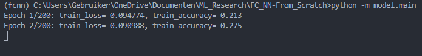

# FC_NN-From_Scratch
This repository implements a neural network from scratch in Python using Numpy. The resulting neural network is trained on the MNIST dataset.

# Environment
This codebase was developed in Python 3.10. Dependancies can be installed as follows:
```sh
pip install -r requirements.txt
```

# Training the neural network
The neural network itself is defined in `model/main.py`, to train the model on MNIST we can run:
```sh
python -m model.main
```
It should look something like this:


# How does the code work?
## Layers
The neural network is a collection of different layers, these layer types are implemented in `model/layer.py`. Every `Layer` implements 2 functions:
- `forward`: This function is used during inference and the forward pass during training. It takes in some input, applies transformation (using the weights and biases) to the input and produces output.
- `backward`: This function is only used during training, to enable backpropagation. The purpose of this function is to calculate the weight/bias error, adjust the weights/biases on the current layer and propagate the input error to the previous layer.


There are 2 `Layer` types supported:
- `FCLayer`: This is the Fully Connected layer and contains all the weights and biases in the network.
- `ActivationLayer`: This layer adds non-linearity to the input, with the goal of improving the generalizability of the neural network. This layers' input dimensions are the same as it's output dimensions and this layer also does not have any weights or biases. 
## Network
The model architecture is defined by an instance of the `Network` class, which is implemented in `model/network.py`. Capabilities of the `Network` class are as follows:
- A `Network` instance consists of multiple layers, which we can add to the network by using the `add` function.
- The loss function and it's derivative (necessary for backpropagation) of a `Network` instance can be defined by using the `compile` function.
- The entire network can be trained by using the `fit` function and performs inference with the `predict` function.

A simple `Network` instance definiton looks like this:
```py
net = Network()
net.add(FCLayer(28*28, 75))
net.add(ActivationLayer(sigmoid, sigmoid_derivative)) 
net.add(FCLayer(75, 50))
net.add(ActivationLayer(sigmoid, sigmoid_derivative))
net.add(FCLayer(50, 10))
net.add(ActivationLayer(sigmoid, sigmoid_derivative))

# train
net.compile(mse, mse_derivative)
net.fit(x_train, y_train, n_epochs=200, learning_rate=0.001)

# test
out = net.predict(x_test)
```
## Utils
Loss functions and activation functions (and their derivatives) are implemented in the `models/utils.py` script.

Currently supported **loss functions**:
- Mean Squared Error (MSE)

Currently supported **activation functions**:
- Sigmoid
- Tanh
- ReLU

## TODO
- Add visualisations of loss, accuracy over training epochs for readme
- Add softmax
- Add mini-batch GD
- Add optimizer
- Add LR scheduler
- Get crazy 